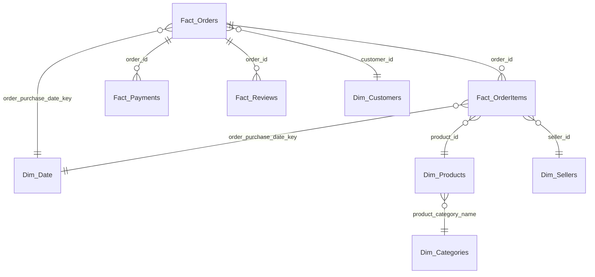

# Autonomous Data Engineering Platform (ADEP)

> A multi-agent, self-healing pipeline that transforms raw CSV/Excel uploads into a validated DuckDB star-schema warehouse and KPI report — driven by the user's stated business questions.

---

## Table of Contents

1. [Problem Statement](#1-problem-statement)
2. [Proposed Solution](#2-proposed-solution)
3. [Tech Stack](#3-tech-stack)
4. [System Architecture](#4-system-architecture)
5. [Database Design](#5-database-design)
6. [Problems Faced](#6-problems-faced)
7. [Conclusion](#7-conclusion)

---

## 1. Problem Statement

Building a data warehouse from raw business files is slow, specialist-gated, and error-prone. The conventional process looks like this:

- A business analyst uploads a folder of CSVs and waits days for a data engineer to profile, clean, and model the data.
- The data engineer manually writes SQL transformation scripts — which often break on first execution due to encoding issues, unexpected nulls, or schema mismatches.
- KPI definitions agreed in a requirements meeting get lost by the time the analytics query is written, so the numbers the analyst sees are often not what they asked for.
- Validating that the warehouse is correct requires a second engineer to audit the SQL — work that is rarely done rigorously.

**Specific gaps this project addresses:**

| Gap | Impact |
|---|---|
| No repeatable process from raw files to a validated warehouse | Every project starts from scratch; mistakes repeat |
| LLM-generated SQL fails silently without a correction loop | Bad data enters production without detection |
| Agreed metric definitions are not enforced at analytics time | Reports answer a different question than the one asked |
| Human oversight at quality gates blocks the autonomous run | The pipeline either requires a human or skips the gate entirely |

---

## 2. Proposed Solution

ADEP is a **multi-agent, self-healing data engineering pipeline** that automates the full journey from raw uploaded files to a validated DuckDB star-schema warehouse with a KPI report — all guided by the user's stated business questions.

### Key Capabilities

- **Conversational BI intake** — An LLM interviewer captures precise metric definitions (numerator, denominator, filters, time window, grain) grounded in previews of the actual uploaded data. Metric ambiguities are surfaced and resolved before the pipeline starts.

- **9-step autonomous pipeline** orchestrated by CrewAI Flow:
  `Profile → Validate Intent → Quality Gate → Schema Design → Transform → Analytics → Verify → Report`

- **Self-healing SQL build** — Per-table generation and execution with up to 3 retries per table using enriched error diagnostics; a second corrective rebuild loop fires after deterministic structural validation catches post-build defects.

- **Answer verification** — Each agreed metric definition is independently translated to SQL and executed against the warehouse. Results are cross-checked against the analytics report; divergence triggers a corrective re-run.

- **Human-in-the-loop quality gate** — When data quality scores below 60/100, the pipeline pauses and surfaces the quality report in a web modal (or CLI prompt) for human approval before proceeding.

- **Web dashboard** — FastAPI + Vanilla JS SPA for file upload, conversational intent intake, pipeline progress tracking, report browsing with download, and a post-pipeline warehouse Q&A chat.

---

## 3. Tech Stack

| Category | Technology | Version |
|---|---|---|
| **Agent Orchestration** | CrewAI (Flows + Crew / Agent / Task) | 1.14.7 |
| **LLM Providers** | Ollama (local) · AWS Bedrock · OpenAI / Anthropic / Gemini | via LiteLLM |
| **Structured Outputs** | Pydantic v2 + instructor | 2.12.5 / 1.15.3 |
| **Data Engine** | DuckDB | 1.5.4 |
| **DataFrame Layer** | Polars | 1.41.2 |
| **Excel Parsing** | openpyxl · python-calamine · fastexcel | — |
| **Web Server** | FastAPI + Uvicorn | 0.138.0 / 0.49.0 |
| **Frontend** | Vanilla HTML / CSS / JS · marked.js · Vanta.js (Three.js) | — |
| **Vector Memory** | ChromaDB | 1.1.1 |
| **Config / Secrets** | python-dotenv · PyYAML | 1.2.2 / 6.0.3 |
| **Observability** | LangSmith · OpenTelemetry + OTLP exporters | 0.9.1 / 1.42.1 |
| **Deployment** | Docker + Railway | — |

**LLM routing:** Four independent model slots (`PIPELINE_MODEL`, `SQL_MODEL`, `VALIDATION_MODEL`, `BI_MODEL`) allow routing different pipeline tasks to the most capable available model without code changes. All three provider types (Ollama, Bedrock, Cloud) are supported transparently.

---

## 4. System Architecture

### Component Diagram

```mermaid
flowchart TD

    START(["Uploaded Files + Business Questions\nCSV / Excel / JSON  |  stated KPI definitions"])

    subgraph DET["Deterministic Pre-processing — no LLM"]
        direction LR
        PROF["ProfileCSVFileTool\nPolars streaming profiler\nnull rates · type inference · schema shifts\nwrites: profiling_report.json"]
        EC["EntityClassifier\nRule-based column-name scoring\n17 entity types — LLM fallback if confidence < 0.4\nwrites: entity_map"]
    end

    A1["AGENT 1 — Intent Validator\nModel: Gemma 4 31B (Ollama)   Tools: none\n---\nReads profiling_results + entity_map from shared state\nOutputs per-question answerability verdicts\nAborts only when ALL questions are unanswerable\nwrites: intent_report.md"]

    A2["AGENT 2 — Quality Engineer\nModel: Gemma 4 31B (Ollama)\nTools: ProfileCSVFileTool · RunDuckDBQueryTool\n---\nScores data quality 0-100\nChecks nulls · duplicates · type mismatches\nQueries source file views — warehouse not built yet\nwrites: quality_report.md"]

    K{"Score < 60?"}

    HUMAN["Human Approval Gate\nWeb modal or CLI\nBlocks on threading.Event\nuntil POST /api/approve resolves it"]

    subgraph WA_BLOCK["AGENT 3 — Warehouse Architect   Model: Qwen3-Coder 480B (Bedrock)   Tools: RunDuckDBQueryTool · ChromaDB"]
        WA_S["Task 1 — Schema Design\nDesigns Fact_ + Dim_ star schema\nEntity map injected as ground truth\nwrites: schema_design.md"]
        WA_P["Task 2 — Build-order plan\nDimensions first, Facts last\nOrdered list with source views per table"]
        WA_G["Task 3 — Generate SQL per table\nCREATE TABLE ... AS SELECT\nReceives: spec · source columns · existing tables"]
        WA_F["Task 4 — Fix SQL per table\nTargeted error + enriched diagnostics\nbranch col counts · available columns · SHOW TABLES\nmax 3 retries per table"]
        WA_S --> WA_P --> WA_G
        WA_G -->|exec error or 0-row Fact| WA_F
        WA_F -->|retry same table| WA_G
    end

    WM["WarehouseMetrics — deterministic Python + DuckDB\n---\nPK uniqueness · retention >= 88%\ncartesian join ratio · negative revenue · date-FK nulls\nColumn names discovered at runtime — no hardcoded fields\nwrites: validation_report.md · verified_metrics.json"]

    A4["AGENT 4 — Analytics Engineer\nModel: GLM-5 (Bedrock)   max_iter=35\nTools: RunDuckDBQueryTool · ChromaDB read+write\n---\nRuns analytics SQL against warehouse.db\nWindow functions · cohort analysis · trend queries\nUses verified_metrics.json as numeric ground truth\nwrites: kpi_report.md"]

    AV["Answer Verifier — Qwen3-Coder 480B (Bedrock) direct call, NOT a CrewAI agent\n---\nFor each agreed KPI definition from intake:\n  1. LLM translates definition to SQL\n  2. DuckDB executes via ConnectionManager\n  3. Cross-checks numeric result vs kpi_report.md\nPer-metric status: CONSISTENT / DIVERGENT / EMPTY / ERROR\nwrites: verification_report.md · sets state.definitions_diverged"]

    A5["AGENT 5 — Lead Architect\nModel: Gemma 4 31B (Ollama)\nTools: ChromaDB search only\n---\nSynthesises all reports from pipeline state\nSearches past runs for comparable projects\nwrites: executive_summary.md · token_usage_report"]

    ACHAT["AGENT 6 — Chat Analyst  on-demand, post-pipeline only\nModel: GLM-5 (Bedrock)   max_iter=8\nTools: RunDuckDBQueryTool\n---\nAnswers ad-hoc natural-language questions\nagainst the built warehouse.db"]

    DONE(["Warehouse Ready\nAll reports generated"])

    ABORT1(["Aborted\nall questions unanswerable"])
    ABORT2(["Aborted\nhuman rejected"])
    ABORT3(["Aborted\nvalidation failed after 2 corrective rounds"])

    START --> DET --> A1

    A1 -->|all unanswerable| ABORT1
    A1 -->|at least one answerable| A2

    A2 --> K
    K -->|score >= 60| WA_S
    K -->|score < 60| HUMAN
    HUMAN -->|Approved| WA_S
    HUMAN -->|Rejected| ABORT2

    WA_G -->|executes SQL via DatabaseService| WM
    WM -->|structural FAIL: table + reason| WA_F
    WM -->|still FAIL after 2 corrective rounds| ABORT3
    WM -->|PASS| A4

    A4 --> AV
    AV -->|DIVERGENT: corrective re-run max 1 round| A4
    AV -->|CONSISTENT or max rounds reached| A5

    A5 --> DONE
    DONE -.->|user asks a question| ACHAT
```



### Design Patterns

| Pattern | Where Used | Purpose |
|---|---|---|
| **StepContext singleton** | `pipeline/core/context.py` | Wires shared `DataEngineeringState`, `ConnectionManager`, and `TokenReporter` into every step without global mutable state |
| **Strategy pattern** | `tools/human_loop.py` | Same approval gate works in CLI (stdin), Web (threading.Event), and CI (auto-approve) — no pipeline code changes |
| **Four LLM slots** | `pipeline/core/context.py`, `agents/factory.py` | Route SQL generation to a code-specialist model, analytics to a reasoning model, without touching pipeline logic |
| **Pydantic at every agent boundary** | `schemas/` | `output_pydantic` on every task enforces typed outputs; malformed LLM responses are caught before they propagate |

### Data Flow

```
User uploads files       →  POST /api/upload   →  data/
User chats intent        →  POST /api/intent/*  →  BusinessIntent (structured)
User clicks Build        →  POST /api/run       →  RunManager [background thread]
                                                    └─ DataEngineeringFlow.kickoff()
                                                       ├─ ProfileStep        (deterministic)
                                                       ├─ IntentValidatorStep (LLM gate)
                                                       ├─ QualityStep        (LLM + DuckDB)
                                                       ├─ HumanGate          (blocks if score < 60)
                                                       ├─ SchemaStep         (LLM)
                                                       ├─ TransformStep      (LLM + DuckDB, self-healing)
                                                       ├─ AnalyticsStep      (LLM + DuckDB)
                                                       ├─ VerifyStep         (LLM → SQL → DuckDB)
                                                       └─ ReportStep         (LLM)
Frontend polls           →  GET /api/status     →  active step + log lines → timeline UI
User asks question       →  POST /api/query     →  ChatAnalyst → DuckDB → answer
```

---

## 5. Database Design

### Dataset-Agnostic Schema Design

ADEP does not assume a fixed schema. It designs a new star schema for every dataset by following a four-step generic process:

**Step 1 — Entity classification** (`tools/entity_classifier.py`)

Each uploaded file is classified into one of 17 e-commerce entity types (orders, payments, reviews, products, customers, sessions, pageviews, refunds, campaigns, inventory, …) using a rule-based scoring engine — no LLM involved. The engine scores column names against synonym lists, applies disqualifiers (columns that rule out an entity type), and expands abbreviations (`txn→transaction`, `amt→amount`, `ord→order`). An LLM fallback fires only when confidence < 0.4.

**Step 2 — Schema design by the Warehouse Architect agent**

The agent receives the entity map + profiling JSON + the user's BI questions and designs a Kimball star schema tailored to the discovered entity types. Hard rules: all fact tables must start with `Fact_`, all dimension tables with `Dim_`. No dataset-specific column names appear anywhere in the agent prompt.

**Step 3 — Dataset-agnostic table naming**

`sanitize_table_name()` maps every uploaded filename to a DuckDB view name (strips extension, replaces non-alphanumeric characters with `_`). Agents write SQL against these view names — the same transformation logic works for any file collection.

**Step 4 — Runtime-discovered structural validation**

All post-build checks discover column names at runtime by suffix pattern (`*_id`, `*_key`, `*date*`) — no hardcoded column names appear anywhere in the validator.

### Three Datasets — Same Pipeline

| Dataset | Domain | Fact Tables | Dimension Tables |
|---|---|---|---|
| **Olist** (Brazilian e-commerce) | Multi-fact transactional | 4 — Orders · OrderItems · Payments · Reviews | 5 — Date · Customers · Products · Sellers · Categories |
| **Maven Fuzzy Factory** (web analytics) | Funnel + attribution | 5 — Sessions · Pageviews · Orders · OrderItems · Refunds | 1 — Products |
| **Amazon Sale Report** (multi-channel retail) | UNION multi-source | 1 — Orders (UNION of domestic + international CSV) | 2 — Products (FULL OUTER JOIN of two catalogs) · Date |

**Amazon was the most complex:** Two CSVs with different schemas were unified into a single `Fact_Orders` table with a `SourceSystem` discriminator column; `Dim_Products` was built with a FULL OUTER JOIN of two product catalogs that had non-overlapping price columns. The Warehouse Architect produced this entirely from entity classification signals and user intent — no dataset-specific code was written.

### Olist Star Schema (primary example)



**Verified metrics (computed directly by DuckDB, not by the LLM):**

| Metric | Value | Source Table |
|---|---|---|
| Canonical Revenue | R$ 16,008,872.12 | Fact_Payments — `SUM(payment_value)` |
| GMV | R$ 13,591,643.70 | Fact_OrderItems — `SUM(price)` |
| Unique Orders | 99,440 | Fact_Payments |
| Average Order Value | R$ 160.99 | Revenue ÷ Orders |
| Total Order Items | 112,650 | Fact_OrderItems |

`Dim_Date` is generated entirely in SQL — no source file required:
```sql
SELECT UNNEST(generate_series(
    (SELECT MIN(...)::date FROM olist_orders_dataset),
    (SELECT MAX(...)::date FROM olist_orders_dataset),
    INTERVAL 1 DAY
)) AS date_key, ...
```

### Structural Validation Thresholds

After every build, five deterministic checks run against DuckDB:

| Check | Condition | Severity |
|---|---|---|
| Data Retention | Fact rows / source rows ≥ 88% | WARN |
| Dim PK Uniqueness | No duplicate primary keys in any Dim_ table | FAIL |
| Cartesian Ratio | Fact rows / distinct IDs < 5.0 | FAIL |
| Revenue Integrity | No negative revenue rows | FAIL |
| Date-FK Null Rate | Null `*date*_key` in primary fact < 20% | WARN |

A FAIL triggers the corrective rebuild loop (up to 2 rounds) before aborting.

---

## 6. Problems Faced

Each challenge is described with: **Problem → Root Cause → Solution.**

---

### 1. Whole-Script SQL Execution Left the Warehouse in a Partial State

**Problem:** The original pipeline generated a single SQL script containing all table definitions and executed it in one pass via DuckDB. If any statement failed mid-script, execution aborted — leaving some tables created and others missing. The error report was a single line against thousands of lines of SQL, making diagnosis nearly impossible.

**Root cause:** Monolithic script execution provides no granularity for diagnosis, retry, or selective recovery. A failure in `Dim_Date` would also destroy `Fact_Orders` even though `Fact_Orders` had no errors.

**Solution:** Switched to **table-by-table execution** (`TableBuilder` in `utils/sql_executor.py`). The Warehouse Architect now produces an ordered build plan (Dim_ tables first, then Fact_ tables). Each table is generated, executed, and validated independently. Errors are caught per-table with enriched context (UNION branch column counts, list of available source columns, `SHOW TABLES` output). The fix task receives only the single failing table's SQL and error message — not the entire 500-line script. This also unlocked the corrective rebuild loop: a defective `Dim_Date` can be regenerated without re-running the entire warehouse.

---

### 2. LLM-Generated SQL Failed on First Attempt

**Problem:** Even with correct schema information, the LLM frequently produced SQL with wrong column references, UNION branches with mismatched column counts, or fact tables that built successfully but contained zero rows.

**Root cause:** The LLM had no feedback on why its SQL was wrong, so it could not correct itself.

**Solution:** A per-table retry loop (`MAX_RETRIES = 3`) feeds the error back to the Warehouse Architect with enriched diagnostics — branch-by-branch column counts for UNION mismatches, the full list of available source columns for missing-column errors, and `SHOW TABLES` output when a referenced table doesn't exist. Zero-row fact tables receive an additional hint to remove `IN (SELECT … FROM Dim_*)` filters that were silently filtering all rows.

---

### 3. Structural Validation Was a Terminal Gate with No Recovery

**Problem:** After building all tables, a single failing structural check (e.g. 1,127 duplicate keys in `Dim_Date` caused by a `UNION ALL` over three overlapping date columns) killed the entire run. There was no way to recover without restarting from scratch.

**Root cause:** Validation was a one-shot gate with no feedback path back to the table builder.

**Solution:** `_validate_with_correction()` in `TransformStep` implements a validate → correct → re-validate loop with up to `MAX_VALIDATION_FIX = 2` rounds. Each structural check title encodes the failing table name (e.g. `"Dim PK uniqueness — Dim_Date"`), so `fix_table()` can target exactly that table. The corrective round sends the specific structural defect as the error message, not a generic "try again." Verified on the real failure: the broken `Dim_Date` self-healed in one corrective round (architect switched from `UNION ALL` to `UNION`; re-validation returned 0 duplicates).

---

### 4. The LLM Validation Agent Fabricated Its Audit

**Problem:** The LLM validation agent was tasked with running 7 SQL assertions against the warehouse. In practice, it ran ONE real query (`SHOW TABLES`), then wrote a plausible-sounding report from prompt context — reporting 4.34% data retention on a warehouse that was 100% intact, and counting only 2 of 5 fact tables. A check that a model can fake is not a check.

**Root cause:** The LLM agent has no obligation to execute a query for every check it reports on.

**Solution:** The validation agent was removed entirely and replaced with `WarehouseMetrics.run_structural_validation()` — a Python loop that executes a real DuckDB query for every check and builds its report from the query results. Every number in the validation report comes from a real query. The LLM cannot skip a check, mis-sum a figure, or fabricate a PASS.

---

### 5. Agreed Metric Definitions Got Lost Between Intake and Analytics

**Problem:** The user defined specific KPIs during the intake conversation (e.g. "revenue = sum of payment_value, excluding cancelled orders"). By the time the analytics agent ran, it had only a vague natural-language summary of the user's goals — it used a different denominator, ignored the cancellation filter, or computed revenue from a different table than agreed.

**Root cause:** There was no structured representation of metric definitions that survived from intake to analytics to verification.

**Solution:** The `KPIDefinition` Pydantic schema (`name` + `definition`) captures each metric definition precisely at intake time. These survive as typed objects through `BusinessIntent` and are injected into the analytics prompt as ground truth. `VerifyStep` independently translates each definition to SQL (via LLM), executes it against DuckDB, and cross-checks the numeric result against the KPI report using a format-tolerant matcher. On divergence, `AnalyticsStep` is re-run with a `CORRECTION REQUIRED` message that names the specific metric and shows the independently computed rows.

---

### 6. `output_pydantic` Enforcement Crashed on Malformed LLM Outputs

**Problem:** CrewAI's `output_pydantic` enforcement raised hard exceptions when LLMs returned surrounding prose or truncated JSON instead of a clean schema-conforming object. This crashed the pipeline even when the LLM had produced a useful partial result.

**Root cause:** `output_pydantic` has no fallback — it either succeeds or raises.

**Solution:** Defensive extraction in `PipelineStep._extract()` — it tries pydantic parse first, then falls back to regex extraction of a `{…}` block from the raw output, then falls back to treating the entire output as a raw string. The pipeline degrades gracefully rather than aborting on a parse failure. Each step also emits a log warning when it falls back so the degradation is visible.

---

### 7. Structured Output Field Order Changed Model Reasoning

**Problem:** `ValidationOutput` was initially defined as:
```python
class ValidationOutput(BaseModel):
    status: Literal["PASS", "FAIL"]  # declared first
    report: str
```
This caused the LLM to commit to a verdict (`status`) before writing its analysis (`report`), producing contradictory outputs where the `status` said `FAIL` but the `report` concluded the warehouse was valid.

**Root cause:** LLMs generate tokens left-to-right. Placing `status` first forced the model to choose a verdict before it had reasoned through the evidence.

**Solution:** Swapped field order — `report` declared first, `status` second. The model now writes its full analysis before emitting the verdict. A comment in `schemas/validation.py` documents this constraint so future developers don't revert it.

---

### 8. Entity Classification via LLM Was Slow and Inconsistent

**Problem:** Early versions asked an LLM to identify the entity type of each uploaded file from its column names. This was slow (one LLM call per file), inconsistent across models, and sometimes wrong — classifying an orders file as "customers" because it contained a `customer_id` column.

**Root cause:** LLMs do not produce deterministic classification from ambiguous column name evidence.

**Solution:** Rule-based `EntityClassifier` with 17 entity types. Each type has a list of required column synonym groups, supporting columns (+2 pts), and disqualifiers (−6 pts). Column names pass through an abbreviation expander (`txn→transaction`, `amt→amount`) before matching. Classification is deterministic and fast. LLM fallback fires only when confidence < 0.4 (the top score is within 80% of random chance). No LLM involved for the common case.

---

### 9. Primary Fact Table Selected by Row Count, Not Semantic Role

**Problem:** The analytics step needed to identify the "primary" fact table for core KPI queries (total revenue, unique orders, AOV). The original heuristic picked the table with the most rows. On the Olist dataset this selected `Fact_Payments` (103,886 rows) over `Fact_Orders` (99,441 rows), causing revenue to be computed from payments instead of the intended transaction table — a different number with a different business meaning.

**Root cause:** Row count is a proxy for importance, not a measure of semantic role.

**Solution:** `EntityClassifier` assigns each source file a semantic role (`orders`, `payments`, `products`, …). The pipeline maps `orders` entity → primary fact table, regardless of row count. The entity map is injected into the schema design, transformation, and analytics prompts as authoritative ground truth, with explicit instructions not to re-classify.

---

### 10. DuckDB File-Lock Conflicts Under Concurrent Web Server Requests

**Problem:** Unmanaged DuckDB connections held write locks across threads. When the frontend polled `/api/status` (which registered source views to compute some state) at the same time a background query job was running, the second connection failed with a file-lock error.

**Root cause:** DuckDB allows only one writer at a time; connections were opened and held for too long.

**Solution:** `ConnectionManager` (in `tools/connection_manager.py`) provides two context managers — `warehouse()` for persistent warehouse access and `source_scanner()` for in-memory source-only queries. Every connection is scoped to a `with` block and closed on exit. A `_df_cache` dictionary avoids re-reading source CSVs on every connection open.

---

### 11. Analytics Agent Thrashed on ChromaDB Memory Tools

**Problem:** The analytics agent entered a tight loop of repeated ChromaDB search calls (`SearchPastExecutionsTool`), consuming its entire token budget without producing any analytics output.

**Root cause:** The agent's prompt gave insufficient guidance on when memory lookup was complete, so it kept searching for "better" past examples.

**Solution:** Prompt-only fix — agent instructions now explicitly state: "search memory once at the start of your analysis, then proceed to compute the KPIs. Do not search again." No code change was required. The fix is documented in the commit history (`perf: stop analytics agent thrashing on memory tools`) so future prompt changes don't accidentally revert it.

---

### 12. Railway Deployment Crash — `ImportError: cannot import name 'SQLQueryInput'`

**Problem:** After deploying to Railway, the container crashed on startup with `ImportError: cannot import name 'SQLQueryInput' from 'schemas' (unknown location)`. The local dev environment worked perfectly.

**Root cause:** Three directories (`schemas/`, `utils/`) and one file (`config.py`) were added to the codebase after the Dockerfile was last updated. They were never copied into the container image. Python resolved `schemas` to an installed namespace package from a transitive dependency instead of the local `schemas/` package.

**Solution:** Added three `COPY` instructions to the Dockerfile:
```dockerfile
COPY schemas/  ./schemas/
COPY utils/    ./utils/
COPY config.py .
```
Root-cause diagnosis: compared Python's module search order (`sys.path`) against the container filesystem listing — the local package simply didn't exist in the image.

---

## 7. Conclusion

### What Was Built

ADEP is a production-deployed, multi-agent data engineering platform that takes raw business data files and autonomously produces a validated DuckDB star-schema warehouse, KPI analytics, and an executive summary — all anchored to the user's specific business questions.

### Key Lessons

- **Deterministic guardrails outperform pure LLM trust at critical pipeline checkpoints.** Rule-based entity classification, Python-loop structural validation, and independent metric recomputation each replaced an LLM call that proved unreliable in practice. The LLM is used for creativity (schema design, SQL generation, narrative reporting) — not for bookkeeping or validation.

- **Table-by-table execution was the single most impactful architectural decision.** It made per-table retry possible, enabled enriched diagnostic injection, and unlocked selective corrective rebuild — none of which were possible with monolithic script execution.

- **Conversational intake + definition anchoring + verification closes the "last-mile" gap.** Without a structured chain from agreed definitions → analytics → verification, the system could produce technically correct SQL that answered a different question than the user asked.

- **The platform is genuinely dataset-agnostic.** The same code, with no dataset-specific logic, produced correct star schemas for three structurally different datasets: multi-fact transactional (Olist), web analytics funnel (Maven Fuzzy Factory), and multi-source retail UNION (Amazon). Entity classification, the Warehouse Architect prompt, and the structural validator all operate on runtime-discovered column names and entity roles.

### Potential Extensions

| Extension | Value |
|---|---|
| Streaming SSE progress (replace polling) | Eliminate frontend polling latency |
| Multi-tenant run isolation | Support concurrent users with separate warehouses |
| Incremental / time-series load | Update existing warehouse tables without a full rebuild |
| Slack / email notifications | Alert users when long pipelines complete |
| BI tool export | Push the built warehouse to Metabase, Superset, or Redash |
| Schema drift detection | Alert when re-uploaded files have changed column structures |
