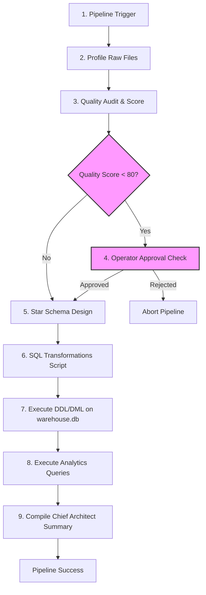
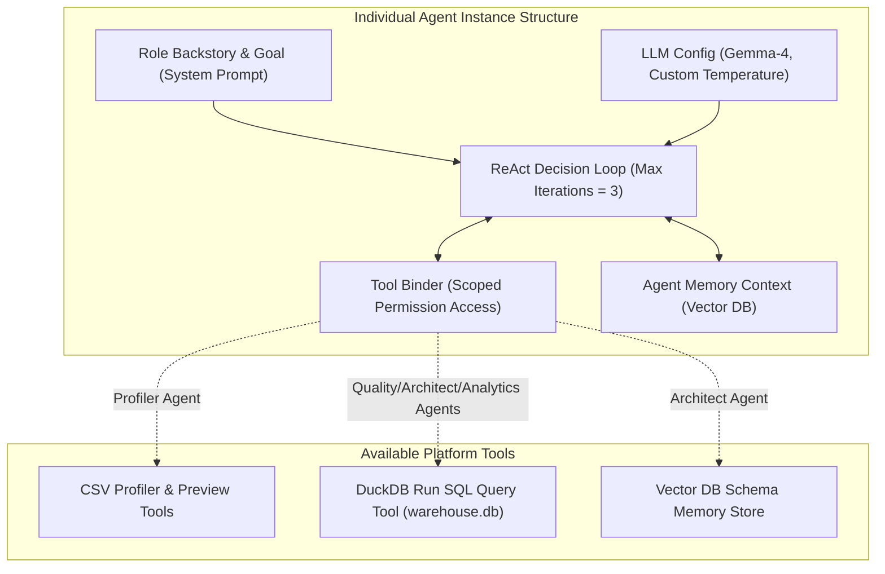
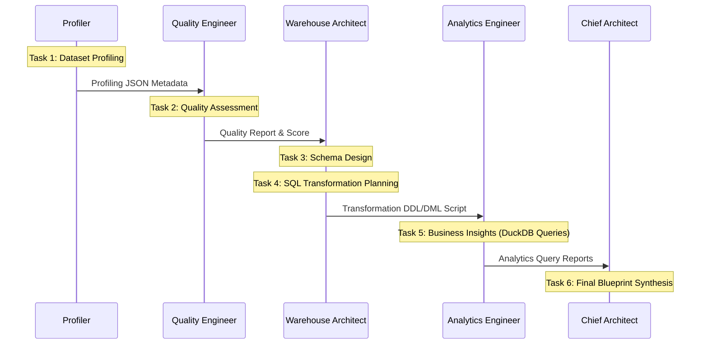

# Autonomous E-Commerce Data Engineering Platform: System Blueprint

This document outlines the architecture, problem definition, agent layout, and technical design of the CrewAI-powered Virtual Data Engineering Team. The platform automatedly profiles, cleans, schemas, transforms, and analyzes raw transactional datasets into an analytics-ready warehouse.

---

## 1. Problem Statement

Modern e-commerce organizations receive data streams from multiple disjointed sources:

- **CRM Systems**: Customer profiles and registrations.
- **Storefronts**: Order transactions and payment logs.
- **Warehouses**: Product catalogs and inventory dimensions.
- **Operational Systems**: Geolocation coordinates, logistics, and review logs.

These datasets are often **inconsistent, undocumented, and dirty** (e.g., duplicated records, missing categories, mismatched data types). For a human data engineering team, manual profiling, data model design (e.g., Kimball Star Schema), SQL transformation script development, database validation, and quality auditing can take **days to weeks** to deploy reliably.

---

## 2. Proposed Solution

This platform establishes a **virtual, hierarchical AI Data Engineering Team** that operates autonomously inside an orchestrated pipeline. By utilizing agent specialists and strict validation guardrails, the platform completes the entire lifecycle—from raw data profiling to executive-level business analytics—in **minutes**.

```
[Raw Files in data/] ──> [Profiling & Metadata] ──> [Quality Audit (Score)]
                                                           │
                                                           ▼
     [SQL DDL/DML Script] <── [Star Schema Design] <── (Score < 80? Yes: Operator Approval)
              │
              ▼
[DuckDB Database warehouse.db] ──> [Advanced Analytics Query Execution] ──> [Executive Reports]
```

---

## 3. System Architecture & Flow

The pipeline orchestrates file processing, state management, and validation transitions using Pydantic state management and CrewAI.



### Key Architectural Standards

- **State-Isolation & DB Persistence**: The database operates on a physical, persistent DuckDB database file (`data/warehouse.db`).
- **One-Time SQL Loading**: Raw tables are loaded dynamically into temporary views, allowing generated SQL scripts to run DDL and DML operations exactly once per execution.
- **Operator Approval Loop**: If the data quality audit yields a score below **80/100**, the orchestrator triggers a blocking command-line prompt requesting human-in-the-loop authorization (`yes/no`) before moving to schema design.

---

## 4. Virtual Crew Structure

Instead of numerous fragmented agents, the crew utilizes **5 strong, specialized roles** with managed execution parameters:

### Agent Profiles

| Agent Role                | Goal                                              | LLM Temperature       | Primary Tools                                    |
| :------------------------ | :------------------------------------------------ | :-------------------- | :----------------------------------------------- |
| **Senior Data Profiler**  | Inspect structural metadata footprint             | `0.0` (Deterministic) | `profile_csv_file`, `read_csv_preview`           |
| **Lead Quality Engineer** | Audit anomalies and compute quality score         | `0.1` (Strict)        | `run_duckdb_query`, `profile_csv_file`           |
| **Warehouse Architect**   | Design Kimball schemas and generate SQL           | `0.1` (Structured)    | `run_duckdb_query`, `save/search_past_execution` |
| **Analytics Engineer**    | Run advanced SQL analytics against database       | `0.2` (Factual)       | `run_duckdb_query`                               |
| **Chief Data Architect**  | Review technical alignment and synthesize summary | `0.5` (Creative)      | `search_past_executions`                         |

### Agent Internal Architecture & Tool Interaction

Every agent created by the `AgentFactory` is structured under a unified template. It wraps the core LLM execution loop with specialized context, bounded iterations, and specific data access tools:



### Task Sequence



---

## 5. Technical Implementation Details

### A. Guardrails & Constraint Checks

- **Valid SQL Alias Syntax**: Prompt constraints enforce that column aliases are never reused within the same SELECT statement expression, preventing DuckDB `BinderExceptions`. Instead, raw column names are referenced directly or defined via CTEs.
- **Referential Integrity Filtering**: The DDL script enforces referential constraints using clean subquery checks during table creation, e.g.:
  ```sql
  WHERE customer_id IN (SELECT customer_id FROM dim_customers)
  ```
- **Deduplication & Nulls**: Temporary tables use `DISTINCT` logic on duplicates (such as geolocation logs) and `COALESCE` statements to fill string sparsity.

### B. Core Execution Results (Factual Metrics)

When run against the 100k Olist E-Commerce dataset, the system successfully executes queries retrieving:

1.  **Sales KPIs**: Revenue (R$ 1.61M), Unique Orders (99.4k), and AOV (R$ 16.28).
2.  **Delivery Latency**: Compares estimated vs actual days, highlighting logistics delays.
3.  **Late Delivery Correlation**: Proves CSAT drops from **4.29 to 2.57** when orders arrive late.
4.  **Graceful Omission**: Safely logs marketing traffic and campaign conversion metrics as `Not Available` since clickstream data is absent from raw source files.
